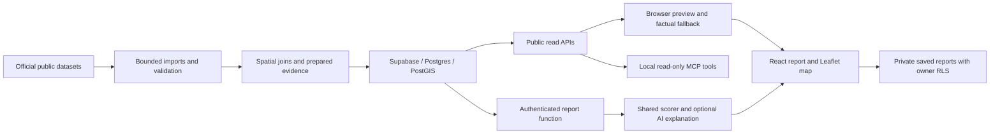

# Someone’s Houston

> [!IMPORTANT]
> **Support discontinued — September 26, 2026.** The hackathon has ended. This public repository is retained as a historical reference; it is no longer maintained or monitored. Automated data refreshes and update checks have been stopped. The hosted backend has been paused with its data retained, so live report generation is offline. Stored datasets retain their original observation dates and expiry rules. Do not rely on this project for current relocation information. See [project retirement status](docs/data-operations.md#project-retired-september-26-2026).

**Find a Houston neighborhood that fits the life you want to build.**

Someone’s Houston helps recruiters and relocating technology candidates compare Houston’s **88 Super Neighborhoods** using their housing, workplace and lifestyle priorities. It turns public datasets into a weighted neighborhood report with an interactive map, category breakdowns and traceable evidence. AI helps organize notes and explain results; a shared deterministic model calculates the scores.

**[Open the report app](https://app.astronix.io)** · [Visit the landing page](https://astronix.io) · [Documentation](docs/README.md) · [Contribute](CONTRIBUTING.md)

The implementation and setup notes below describe the completed hackathon project. They are preserved for reference, not as a commitment to ongoing hosting, support or data freshness.

## Try a comparison

1. Create a username/password account or sign in.
2. Optionally paste relocation notes, then review and edit the extracted preferences.
3. Choose rent or buy, office or remote work, a workplace hub, an airport and eight priority weights. These controls determine the ranking; notes do not silently change your priorities.
4. Select **Generate report**. Explore the shortlist, all-neighborhood comparison and geographic map.
5. Select a neighborhood to inspect the measurements, source periods, limitations and conservative ranking inputs behind its score.
6. Adjust your priorities and compare again. For example, switch to remote work to remove commute from the calculation.

If the AI quota is exhausted or narration is unavailable, generation falls back to the **factual report without an AI explanation**. Rankings and evidence still require valid database inputs; a failed data read never produces invented neighborhood facts.

The private dashboard implementation saves report preferences and snapshots to the signed-in account. Reopening a saved report recalculates with current evidence. A failed save leaves the report viewable and offers a retry. Public report-sharing links are not implemented. See [saved reports and verification](docs/private-saved-reports.md).

## What we built

### Public Houston data prepared for comparison

The backend combines City of Houston and ACS neighborhood profiles, effective FEMA flood mapping, public facility inventories, a USDA grocery subset and destination reference points in **Supabase/Postgres with PostGIS**. Importers validate source records and geographic coverage before publishing versioned data. The evidence layer prepares eight categories for each of 88 neighborhoods: **704 category-evidence records**.

| Priority | What the current model measures |
| --- | --- |
| Affordability | ACS estimated median gross rent or home value, depending on rent/buy mode |
| Commute | Straight-line proximity to the selected workplace hub; excluded in remote mode |
| Flood context | Share of neighborhood land in validated mapped flood-hazard coverage |
| Local amenities | Distance-weighted access to imported libraries, museums and community facilities within 3 miles of a neighborhood reference point |
| Fitness and recreation | Proximity to imported parks and community centers |
| Grocery access | Proximity to the covered USDA SNAP-authorized grocery subset |
| Airport access | Straight-line proximity to IAH, HOU or the nearer airport |
| Healthcare access | Distance-weighted access to imported hospitals, health facilities and multi-service centers within 3 miles |

Historical HPD counts appear separately as public safety context; they do not alter scores or become a safety tier. Additional API/MCP context includes school locations, METRO schedules, and expiring NWS alerts and USGS gauge observations. See [expanded data context](docs/expanded-context.md) and [live feeds](docs/live-feeds.md).

### Explainable ranking across all 88

The browser and authenticated report function use the same **`houston-access-v2`** scoring implementation and **`source-bounded-v1`** evidence envelope. Explicit weights, category contributions and stable tie handling make comparisons reproducible. Scores are relative to the available neighborhood cohort, not independent quality ratings.

Six missing inputs have disclosed conservative bounds from official sources: a published rent band for Hidden Valley and FEMA-derived classification bounds for five neighborhoods. Original missing observations stay `null`. Reports identify the range, source and conservative value used for ranking. This supports all 88 without dropping selected priorities while those inputs remain valid; expired or mismatched evidence can still leave a neighborhood unranked.

See the [scoring methodology](docs/scoring-matrix.md) and [all-88 source methods](docs/all-88-frontend-guide.md).

### AI assistance that can fail without losing the report

The server validates candidate input, reads authoritative evidence and computes the ranking before requesting an explanation. Structured output validation and checked fact references constrain the narrative to supplied evidence. Supabase Auth verifies callers; atomic quotas, duplicate-request checks and bounded model calls control AI usage. Provider credentials stay server-side.

Quota exhaustion, quota-service failures and model failures return a factual report when evidence remains valid. The browser also has a fallback through its public scoring client for report-endpoint failures. No paid model call is made by the fallback. Authentication and data validation remain separate requirements.

Seven local, read-only **MCP tools** expose neighborhood facts and deterministic scenario comparisons to compatible agents. The MCP comparison retains the legacy strict proximity model for audit use; it is not identical to the report app’s newer nearby-access and conservative-bound policy. MCP does not provide arbitrary SQL, writes or an autonomous agent with durable memory.

### Geographic context and efficient reads

The **Leaflet** map combines OpenStreetMap tiles with simplified canonical neighborhood boundaries from Supabase. Reference points, shortlisted neighborhoods and the selected workplace use geographic coordinates. Tile and boundary failures have separate recovery controls.

Expensive imports and spatial joins happen before a report request. The application loads one compact scoring cohort, reuses it when priorities change, and fetches detailed evidence for selected neighborhoods. Request coalescing, bounded responses and caches that respect source deadlines reduce repeated work. Full-precision geometry supports backend calculations; simplified geometry keeps map responses smaller.

## Architecture



Built with **React, TypeScript, Vite, Supabase Auth and Edge Functions, Postgres/PostGIS, Python, SQL, Vercel AI SDK/OpenRouter, Leaflet/OpenStreetMap and MCP**.

Data publication is atomic: failed validation preserves the active dataset. Source receipts, hashes and evidence versions retain provenance. Explicit grants and row-level security separate public reference reads, privileged publication and private account records.

## What the data can tell you

- **Housing:** ACS 2020–2024 estimates describe neighborhood housing, not current listings, personal payments or individual salaries.
- **Access:** straight-line proximity and facility inventories do not establish travel minutes, opening hours, insurance acceptance or service quality. Grocery coverage is not a complete dining inventory.
- **Floods:** mapped land-area exposure is not the probability that a particular home will flood. Current gauges and alerts are separate operational context.
- **Public safety:** selected historical 2024 HPD counts are not population-adjusted crime rates or safety ratings. School locations do not establish school quality or attendance eligibility; METRO schedules are not live arrivals.
- **Freshness:** a retrieval date does not change the observation period. Unknown, expired or inconsistent measurements remain unavailable rather than becoming a favorable zero.

Route-time estimates, current comparable listings, public report sharing and individualized tax calculations remain outside the completed workflow. Listing Watch requires a separately configured delivery webhook. The dashboard’s synthetic candidate scenarios are labeled separately; their live calculations still use the real Houston evidence API.

## Run locally

Use **Node.js 22.12+**; CI uses Node 24.

```sh
git clone https://github.com/Akretic/Someone-s-Houston.git
cd Someone-s-Houston
npm --prefix frontend/report-web ci
```

Copy `frontend/report-web/.env.example` to `frontend/report-web/.env.local` and set the Supabase URL and publishable key. Never put administrative or model-provider secrets in frontend configuration.

```sh
npm --prefix frontend/report-web run dev
```

Use [frontend setup](frontend/README.md) for environment and deployment details, [backend setup](backend/README.md) for imports and MCP, and [authentication setup](docs/auth-setup.md) for username accounts. An unconfigured checkout cannot generate live reports by substituting mock data.

## Verify the implementation

```sh
npm --prefix backend ci --ignore-scripts
npm --prefix backend test
npm --prefix frontend/report-web test
npm --prefix frontend/report-web run build
```

CI also checks Python import safeguards, database permissions and publication behavior, Deno model boundaries, and desktop/mobile report journeys. Browser tests intercept service responses; passing CI is distinct from verifying production authentication, report generation and saving.

With public API configuration supplied, `npm --prefix backend run test:live` checks API/MCP access. `node backend/tools/check-nearby-access.mjs` checks the current report model using frontend environment configuration. The [reproducible backend comparison](docs/backend-demo-proof.md) documents the separate strict-MCP scenario test and dated cached-comparison timings; those measurements are not AI latency or a load-capacity claim.

## Repository guide

| Path | Purpose |
| --- | --- |
| [`frontend/report-web/`](frontend/report-web/) | Report application, authentication, private dashboard and map |
| [`website/`](website/) | Public landing-site source |
| [`shared/`](shared/) | Shared scoring implementations and typed contracts |
| [`backend/src/`](backend/src/) | Validated data clients, publishers and local MCP server |
| [`backend/tools/`](backend/tools/), [`backend/scripts/`](backend/scripts/) | Source preparation and verification |
| [`backend/supabase/`](backend/supabase/) | Migrations, SQL tests and Edge Functions |
| [`docs/`](docs/README.md) | Contracts, methodology, source provenance and operations |

Frontend: [Oleggo1](https://github.com/Oleggo1). Backend: [Akretic](https://github.com/Akretic).

For agent-assisted development, start with [AGENTS.md](AGENTS.md), [CLAUDE.md](CLAUDE.md) and the [frontend/backend handoff](docs/frontend-backend-handoff.md). Preserve the implemented validation, source freshness, access controls and missing-data rules.
