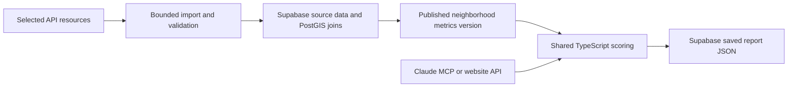

# Supabase backend and relevant-data policy

Decision recorded 2026-09-19: use Supabase for normalized source data, prepared neighborhood metrics, and saved reports. Keep the TypeScript scoring package and proposed Cloudflare Workers MCP/API services. Supabase replaces KV as the report store. This document specifies the implementation plan; no Hou Match project, schema, or importer has been provisioned yet.

## Import only what a relocation decision needs

Each source must have a named report metric, selected columns, geographic coverage, time window, and freshness rule before import. The broad catalog remains a discovery index, not an instruction to download every dataset. Scope Houston inputs to the covered Super Neighborhoods; fetch only the needed comparison-city aggregates for San Francisco and New York.

The windows and freshness limits below are proposed product defaults, not provider guarantees or statistical standards. Revisit them explicitly if source validation shows they are unsuitable; never silently expand the window to make a metric available.

| Input | Import window | Proposed refresh and eligibility |
| --- | --- | --- |
| Neighborhood income, home value, optional rent | One latest compatible ACS five-year release; retain geography, estimate, source period, and uncertainty where available. The latest Houston resources verified so far end in 2024. | Check release metadata monthly; import when a new compatible release is available. If the portal lags Census, verify a newer source or clearly mark the older baseline. No historical trend panel in v1. |
| Origin-city comparison figures | One release with the same ACS product and period used for comparable Houston figures. | Refresh with the housing release. Do not mix one-year and five-year estimates in the same comparison. |
| Crime context | The newest three complete calendar years with consistent categories, geography, and denominators. Import only those year/category fields when using a summary layer. | Check for new publications monthly. For current scoring, the latest complete year must end no more than 18 months before the report date. Shorter or older coverage needs a separately reviewed method; do not quietly backfill older years. |
| 311 services | Latest 12 complete months with complete open/closed coverage; exclude unrelated request categories. | Check daily once a suitable source is verified. The last complete month must end within 90 days of the report date. An open-cases-plus-recent-closures feed is insufficient for annual closure statistics. |
| Permit momentum, if retained | Latest 24 complete months: 12 months compared with the preceding 12, with matching geography and permit definitions. | Check monthly. The final month must end within 90 days. Requires geocoded records or valid neighborhood aggregates; otherwise omit momentum. |
| Flood and neighborhood geometry | Current official effective layers, including applicable revisions, limited to the study area. | Check metadata monthly and replace on verified updates. Effective status matters more than file age; preliminary maps must be distinguished from effective maps. No blanket age cutoff and no decade of incident records for v1. |
| Tax and office references | Report-year tax assumptions and current office coordinates. | Check before release and on year/version changes. Keep only reference versions needed by unexpired reports. |

An ACS five-year estimate is one pooled statistical product, not five separate annual snapshots we need to ingest. For example, the 2024 release represents 2020–2024 observations. It supports small-area estimates but must not be labeled a current asking price. Adjacent five-year releases overlap and should not be treated as independent annual price changes. See [Census product guidance](https://www.census.gov/programs-surveys/acs/guidance/estimates.html) and [comparison guidance](https://www.census.gov/programs-surveys/acs/guidance/comparing-acs-data.html). A live listing feature would need a separate verified current source and is outside this policy.

Current effective flood information can remain relevant even when the original map is older. Validate the City's layer against authoritative effective coverage and revisions before using it. See [FEMA's effective-map guidance](https://emilms.fema.gov/is_0273/groups/268.html). Floodplain overlap remains neighborhood context, not a parcel-level guarantee.

## Freshness and coverage are eligibility checks

Store `period_start`, `period_end`, `source_published_at` when provided, `fetched_at`, `source_checked_at`, geography/version, source URL/resource ID, and coverage status. Downloading an old file today changes only `fetched_at`.

- Select a common complete period across neighborhoods before comparison. Do not annualize an incomplete month/year without an explicitly validated method.
- Re-evaluate freshness at report creation, including for cached or fallback data. A successful download or a recent snapshot timestamp does not bypass these rules.
- The discovered HPD summary ends in 2024, so it fails the proposed 18-month limit on 2026-09-19. Retain it as a discovery reference; obtain and validate newer complete data before current scoring. A newer usable source has not yet been verified.
- The tested 311 feed has records only as recent as May 2026 and incomplete historical closure coverage. It is ineligible for the proposed services score. The citywide permit series cannot supply neighborhood momentum regardless of its dates.
- Unavailable data is never zero crime, good service, or clear flood exposure. Use one consistent available metric set across neighborhoods and disclose omitted factors. If an optional score component is omitted, renormalize weights once for the whole comparison. A required filter with unknown data must produce an explicit limitation or insufficient-data result, not a silently favorable match.
- Crime remains excluded from brokerage-branded scoring and report output, as required by the build plan. Any change to its core status for other reports is an explicit product decision.

## Keep source work outside report requests

1. Filter at the provider by resource/year, date, geography, and selected fields where supported. CKAN supports field selection and filters; ArcGIS supports query filters. Use bounded pagination, stable ordering, timeouts, and a per-source row/byte budget. Stop for validation when a budget is exceeded. If server filtering is unavailable, stream the minimum necessary file and discard irrelevant records before storage; document that exception. Never add a decade-wide backfill by default.
2. Upsert using stable source IDs. Use a modified-time cursor only where updates and deletions are reliably represented; a creation-date cursor misses later corrections. Otherwise re-fetch the bounded window and reconcile records on a successful complete import. Keep the last validated version if an import fails.
3. Clean values and do geographic joins during imports. Resolve the ACS crosswalk and aggregation method before publishing metrics; database speed cannot make averaged medians valid neighborhood medians. Include compatible population only where needed for validated rates. Validate geometry/units and use spatial indexes for larger spatial joins.
4. Publish a complete metrics version transactionally after validation. Aim for one compact metrics row per covered neighborhood, approximately 88 rows per version, with provenance and unavailable flags. Keep raw events and full polygons out of this scoring response.
5. Read the prepared rows in one database request or use a version-keyed cache, then apply candidate-specific salary, office, distance, budget, and weight calculations in the shared scoring package. Ordinary report generation makes no upstream Houston API requests. The generic Open Data MCP can still make bounded live queries, labeled with source periods.
6. Save the final JSON and its data/scoring/reference versions in Supabase. Both MCP and website use the same backend service. Report reads return the stored result and check its 30-day expiration; they do not recompute it against newer data. Cache shared public reference data separately from salary-containing reports.

Start with a prepared metrics table and an active-version pointer; a materialized view is optional, not a second required implementation. Query/index design should follow actual access patterns: unique source IDs for deduplication, neighborhood/version keys for metrics, and a unique unguessable report token for lookup. Measure real query plans before adding complexity. [Supabase query optimization](https://supabase.com/docs/guides/database/query-optimization), [PostGIS](https://supabase.com/docs/guides/database/extensions/postgis), and [Data API](https://supabase.com/docs/guides/api).

## Bounded retention and access

- Keep only active-window normalized event data and current reference inputs. Keep the current and previous validated metrics versions for rollback; additionally retain minimal derived inputs referenced by unexpired reports until seven days after the final referencing report expires. Old versions are never selected for new reports merely because they remain stored.
- Keep raw download staging private and expire it seven days after successful publication. Store selected fields only; do not ingest requester names, contact details, or free-text complaint narratives. Retain compact import manifests, checksums, counts, and source dates for reproducibility.
- Reports contain no required candidate contact details. Store them privately, enforce token-specific access and expiration through the backend, and prevent public enumeration of the reports table. Explicit grants and RLS accompany any exposed tables; privileged keys stay on the server. Schedule expired-report cleanup separately from access checks.
- Provisioning, migrations, scheduled jobs, and retention enforcement remain unimplemented.

## Implementation checks

Before calling this ready: prove imports honor each source window; reject incomplete/stale coverage; verify repeat imports do not duplicate data and corrections are applied; verify failed imports leave the active version intact; and confirm report creation performs no source API calls. Verify report access/expiration and measure warm/cold latency with realistic payloads. No performance result or latency guarantee has been established yet.
