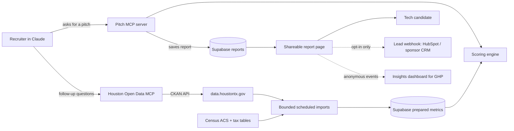

# Hou Match: Build Plan

> A recruiter types a tech candidate's city, current salary and offer. The candidate gets a shareable page showing how far that money goes in Houston compared with San Francisco or New York, built on the City of Houston's own open data.

Hackathon track: **Houston Open Data**. Status: planning.

Backend decision, 2026-09-19: use **Supabase** for prepared neighborhood data and saved reports. The first [neighborhood reference layer](neighborhood-layer.md) is live: 88 validated City profiles, a read-only REST API, and a local Claude MCP connector. The [backend data policy](backend-data-policy.md) defines bounded import windows, freshness checks, and the fast report path. It supersedes the original KV storage proposal and live-first scoring approach. Report/scoring services and Cloudflare hosting remain proposed.

---

## Why Houston

> **Purpose-Driven AI:** Houston isn't chasing AI for AI's sake. Our unique advantage lies in pairing advanced machine learning with the deep domain expertise of our massive industrial base—modernizing energy, aerospace, and healthcare infrastructure from the ground up.

This is the career half of the pitch. The numbers answer "can I afford a better life there?" This answers "is the work worth moving for?" Every report opens with this statement, so the candidate sees the mission first and the math second.

---

## Who it is for

### The person we are convincing (ICP)

**Tech workers in high-cost metros who have a Houston opportunity in front of them.**

| Attribute | Definition |
|---|---|
| Roles | Software, data and ML engineers; product managers; designers; engineering managers |
| Where they are now | San Francisco Bay Area and New York City for v1. Seattle, Boston and Los Angeles next |
| Pay band | Roughly $120k to $300k base |
| Situation | A Houston offer or recruiter conversation in hand, **or** a remote job they can take anywhere |
| What they believe | "Houston is cheap but I'd take a pay cut, it floods, and there's no tech scene" |
| What changes their mind | Their own numbers, an honest flood check, and proof the work is serious |

Two scenarios matter for tech people, and the report handles both:

- **Offer mode.** The Houston offer is often lower than the coastal salary. The report compares current salary there against the offer here. The point it makes: a lower offer can still mean a bigger life.
- **Remote mode.** Same salary, new city. This is the strongest "live like a king" case and needs no recruiter at all.

### The customers who pay

| Customer | Who they are | Why they would pay | What they need from us |
|---|---|---|---|
| **Greater Houston Partnership (GHP)** | The region's chamber of commerce and economic development organization. Already markets Houston on affordability, industries and talent | A personalized version of a claim they make generically today, offered to member companies as a talent-attraction benefit | Industry framing, GHP branding, anonymous insight into who is considering Houston, and eventually 12-county coverage |
| **MoveMeToTX (MMTX)** | A Houston real estate team focused on people relocating for work | Qualified leads earlier than their current funnel: a tech buyer with a known budget and three shortlisted neighborhoods | Co-branding, an opt-in "talk to a local expert" button, links to their listings, a rent vs buy view |

### The people who use it

| User | What they do |
|---|---|
| Recruiters and hiring managers at Houston employers (many are GHP members) | Generate a report from Claude and send the link |
| Tech candidates | Open the link, share it with a partner, optionally ask for a local expert |
| Remote tech workers | Arrive from a GHP or MMTX campaign and run it for themselves (after the hackathon) |

### Business model (one slide in the demo)

| Payer | Model |
|---|---|
| Employers and recruiters | Per seat, or bundled as a GHP member benefit |
| GHP | Annual license: branded reports plus the insights dashboard |
| MMTX | Per qualified, opted-in lead; sponsor placement on reports |

---

## In plain English

**The problem.** Houston loses tech candidates to San Francisco and New York on reputation, not on math. A recruiter saying "it's cheaper here" is not convincing. A page that shows *this* engineer what *their* offer buys, neighborhood by neighborhood, is.

**What it does.** The recruiter opens Claude and asks:

> Build a Houston pitch for a senior ML engineer in San Francisco making $210k. Our offer is $185k and the office is at the Ion.

About a minute later she has a link. The candidate opens it and sees:

1. **Your work.** The Purpose-Driven AI statement and the industry hub their office sits in.
2. **Your money.** Take-home on the current salary there vs the offer here, with the tax math shown.
3. **Your house.** How many years of take-home the median home costs, there vs here. Toggle for renting.
4. **Your standing.** Where their salary sits against the typical household in each Houston neighborhood ("you would earn 2.4x the neighborhood median"). This is the "live like a king" number.
5. **Your top 3 neighborhoods.** The three best places to live for this person: within budget, a short commute to the office, and a good safety tier from HPD crime data. Each card also shows a city-services score, a flood check and a "heating up or cooling off" signal. See [How the top 3 are picked](#how-the-top-3-are-picked).
6. **The honest part.** Property tax, flood risk, heat and car dependence, stated plainly. Equity and bonuses are not modeled, and the page says so.
7. **Next step.** An optional, opt-in button to talk to a local expert. Sponsor-branded when a sponsor is configured.

**Why the honest part matters.** Engineers distrust marketing and will check the math. Property tax is included, not hidden, so the headline number survives a skeptic with a spreadsheet.

---

## How it works

Three pieces. Two are MCP servers, which are plug-ins that let Claude call our code.



| Piece | Job | Notes |
|---|---|---|
| **Houston Open Data MCP** | Generic, read-only access to any dataset on the city portal | Separate plan: `docs/houston-open-data-mcp.md`. Reusable beyond this project |
| **Pitch MCP** | Takes city, salaries and office, runs the scoring, returns a report link | The product |
| **Report page** | The page the candidate opens | Static render of stored JSON, no login, sponsor slot, opt-in lead button |

**Why two MCP servers.** The Pitch MCP produces reports deterministically for the same candidate inputs and data/scoring/reference versions. The Open Data MCP stays connected in the same chat so the recruiter can ask follow-ups the report did not cover ("what do 311 complaints look like around the Heights?"). Imports and the Open Data MCP share one CKAN client library. The Pitch MCP scores prepared Supabase data through shared packages; it does not call the other MCP server or fetch upstream datasets during report generation.

---

## Office presets (the industry layer)

Tech jobs in Houston cluster around its industries. The recruiter picks a preset instead of typing an address, and the report names the hub.

| Preset | Industry story |
|---|---|
| The Ion / Midtown | Startups and innovation district |
| Downtown | Corporate headquarters, energy trading, finance |
| Energy Corridor | Energy majors and energy transition |
| Texas Medical Center | Healthcare and life sciences |
| NASA / Clear Lake | Aerospace and commercial space |

Presets live in `backend/data/reference/office-presets.json` with coordinates and a two-line description. Custom addresses still work.

---

## Data

### From the Houston portal (the track requirement)

| Dataset | Used for | Status |
|---|---|---|
| Median Household Income and Median Housing Value | Affordability and the "your standing" ratio | Core. Verify geography level and year |
| 311 service requests | City-services score per neighborhood; flooding and drainage complaints | Verify fields and date range |
| Building permits | Momentum signal: permit activity trend | Verify it is in the datastore, not a file link |
| Floodplain layers | Flood check | Likely GIS files; may need a one-time preprocess |
| HPD NIBRS crime summary by Super Neighborhood, 2020 to 2024 | Safety tier for the top 3 (see guardrails) | Published by the City's GIS team (HITS) as an ArcGIS feature layer, already summed per Super Neighborhood. Verify the matching listing on data.houstontx.gov in Phase 0. Fallback: HPD's monthly NIBRS Excel files by street and beat |
| Payroll (city employees) | Optional panel: what city IT roles earn, as a local floor benchmark | Through 2023 only. Not a tech-salary source; never label it as one |

Target: at least three portal datasets joined in the final score.

### From outside the portal

| Source | Used for |
|---|---|
| Census ACS | Median income, home value and rent for the candidate's current city |
| Federal, state and local income tax tables | Take-home pay. Texas has no state income tax; California, New York State and New York City do |
| Property tax rates | Annual cost of owning, so the comparison is fair |

All outside figures live in `backend/data/reference/` with a source and date on every file. No number appears on a report without a source line under it.

### Reliability

Scheduled imports validate only the relevant source windows and publish versioned neighborhood metrics in Supabase. Reports use the prepared version, with a dated snapshot available for fallback. A failed refresh keeps the last validated version, but fallback data must still pass metric-specific freshness checks. Source periods are displayed separately from download dates. See [backend data policy](backend-data-policy.md).

### Known limit

The portal covers the City of Houston. The Woodlands, Katy, Sugar Land and the rest of GHP's 12-county region are outside it. Fine for the hackathon; on the roadmap for a GHP deal.

---

## The scoring

Kept simple enough to explain on one slide.

| Metric | Formula | Shown as |
|---|---|---|
| Take-home change | Net pay on the Houston offer minus net pay on the current salary | Dollars per year |
| House multiple | Median home value / annual take-home | "4.1 years here vs 11.3 there" |
| Rent share | Median annual rent / annual take-home | Percent, both cities |
| Standing | Candidate salary / neighborhood median household income | "2.4x the neighborhood median" |
| Services score | 311 volume per capita and median days to close | 0 to 100 |
| Safety tier | Crimes against persons and property per 1,000 residents, from the HPD NIBRS summary | Lower / Typical / Higher than the city median. Tiers, never a ranked list |
| Commute | Distance from neighborhood center to the office; real drive time later | Miles, and a hard cap (default 8 miles, recruiter can change it) |
| Flood check | In mapped floodplain? Flooding complaints nearby? | Clear / Caution / Avoid |
| Momentum | Permit count trend, last 12 months vs prior 12 | Rising / Steady / Cooling |

### How the top 3 are picked

Filters first, then a score. Every step is shown on the report so the candidate can see why a place made the list.

1. **Commute cap.** Drop every neighborhood farther from the office than the cap (default 8 miles straight-line in v1).
2. **Budget.** Drop neighborhoods where the house multiple, or rent share in rent mode, is above a sane limit for this salary.
3. **Flood.** Drop anything marked Avoid.
4. **Score what is left:** 35% affordability, 30% commute, 25% safety tier, 10% services. Momentum breaks ties.
5. **Return the top 3,** each with a one-line reason ("12 minutes from the Ion, lower-than-typical crime, 3.8 years of take-home for the median home").

If fewer than three survive, the cap widens in 2-mile steps and the report says so.

**On the crime data.** HPD itself advises against raw comparisons between areas. So we use per-capita rates, not raw counts; show three tiers, not a league table; use the multi-year summary, not a single month; and print the source and years under the number. Downtown-type areas with few residents and many visitors get a note, because per-resident rates overstate them.

### Guardrails

- **No demographics.** Scoring uses only price, income, services, flood, permits and commute. No demographic fields are read, scored or displayed.
- **Realtor-branded reports drop the safety tier.** Real estate agents work under fair housing rules against steering. When the sponsor is a brokerage, the safety tier is hidden and removed from the weights (they are re-spread across affordability, commute and services), and the page links to official HPD sources instead. This is a config flag, `sponsor.type = "brokerage"`.
- **Not modeled, and stated on the page:** equity, bonuses, 401(k) match, childcare, insurance.

---

## Pitch MCP tools

| Tool | Input | Returns |
|---|---|---|
| `list_office_presets` | none | Preset names, hubs and coordinates |
| `compare_cities` | current city, current salary, offer salary (defaults to current for remote mode), filing status | Take-home in both cities, house multiple and rent share in both, sources |
| `rank_neighborhoods` | salary, office preset or address, rent or buy, max commute miles (default 8), priorities (optional) | The top 3 neighborhoods with all metrics, the reason line for each, and which filters removed the rest |
| `build_report` | everything above, plus optional role title, company name and sponsor ID | A report URL and a short summary for the chat |
| `get_report` | report ID | The stored JSON, so Claude can answer questions about an existing report |

Each tool description states when to use it, what the arguments mean and what comes back, because that text is all the model sees when choosing.

### Sponsor config

```json
{
  "id": "mmtx",
  "type": "brokerage",
  "name": "The MOVEMETOTX Team",
  "logo": "…",
  "cta_label": "Talk to a Houston relocation expert",
  "listing_url_template": "…",
  "lead_webhook": "…"
}
```

One file per sponsor in `backend/data/sponsors/`. GHP gets `type: "edo"`: branding and the industry panel, no lead button by default.

### Privacy and consent

- No candidate name or email is needed to build a report. A report holds city, salaries, office and results under a random unguessable ID, and expires after 30 days.
- The lead button is **opt-in only**. The candidate types their own contact details, sees exactly who receives them, and ticks a consent box. Nothing is sent otherwise.
- Insights events are anonymous and aggregated: origin city, salary band, role family, winning neighborhood. No report IDs, no contact data.

---

## Repo layout

```
hou-match/
  README.md                     # collaboration guide (existing, unchanged)
  AGENTS.md, CLAUDE.md          # existing
  docs/
    build-plan.md               # this file
    api.md                      # API contract between frontend and backend (existing)
    houston-open-data-mcp.md    # plan for the generic data server
    demo-script.md
    data-notes.md               # what we verified about each dataset
    customers.md                # GHP and MMTX notes, pricing assumptions
  backend/                      # owner: @Akretic-Sean
    ckan-client/                # shared: one function per CKAN action
    houston-data-mcp/           # generic open data server
    scoring/                    # pure functions, fully unit tested
    pitch-mcp/                  # the product server
    data/
      snapshots/                # cached portal pulls, dated
      reference/                # tax tables, ACS extracts, office presets
      sponsors/                 # one config per sponsor
    scripts/refresh-snapshots.ts
  frontend/                     # owner: @Oleggo1
    report-web/                 # the candidate-facing page
```

**Contract.** The report JSON shape is the interface between `backend/` and `frontend/`. Agree it in `docs/api.md` before Phase 3.

**Stack.** Supabase is selected for prepared data and stored reports, with PostGIS for geographic processing. TypeScript, the official MCP SDK with Streamable HTTP, Cloudflare Workers for both servers, and a report page rendered from JSON remain the proposed application stack. Hosting configuration and actual plan costs still need verification.

---

## Build plan

Phases are ordered so there is a working demo as early as possible. Hours are estimates for two people; adjust to the deadline.

### Phase 0: Verify the data (2 h)

- [ ] Open each dataset in the table above. Record in `docs/data-notes.md`: geography level, year, datastore or file, row count, key fields
- [ ] Apply `docs/backend-data-policy.md`: selected fields/geography, bounded time windows, complete coverage, and freshness eligibility
- [ ] Confirm the income and housing dataset's neighborhood unit and find a matching boundary file
- [ ] Confirm the HPD crime summary uses the same Super Neighborhood unit as the income and housing dataset; pull population per Super Neighborhood for per-capita rates
- [ ] Decide what replaces any dataset that fails the check
- [ ] Pull first snapshots

**Done when:** we know exactly which three or more portal datasets are in.

### Phase 1: Data layer (4 h)

- [ ] `ckan-client`: `package_search`, `package_show`, `datastore_search`, 15 s timeout, clear errors
- [ ] `houston-data-mcp` with four tools: `search_datasets`, `get_dataset`, `get_resource_schema`, `query_resource`
- [ ] Row cap of 500, default 50, always return total count
- [ ] Deploy, connect to Claude, ask it a real question

**Done when:** Claude answers "show 311 requests by category" from live rows.

### Phase 2: Scoring engine (5 h)

- [ ] Tax calculator with reference tables for TX, CA, NY and NYC; unit tests against hand-worked examples
- [ ] Offer mode and remote mode (offer salary defaults to current salary)
- [ ] Property tax included in cost of owning
- [ ] House multiple and standing from the income and housing dataset
- [ ] Services score from 311; flood check; momentum from permits
- [ ] Safety tier from the HPD NIBRS summary, per 1,000 residents, three tiers
- [ ] Office presets file; commute as straight-line distance for v1, with the hard cap
- [ ] Top 3 picker: filters, weighted score, reason line, cap-widening fallback

**Done when:** `rank("San Francisco", 210000, 185000, "ion")` returns three neighborhoods with all metrics from a test.

### Phase 3: Pitch MCP and report page (6 h)

- [ ] Five tools wired to the scoring package
- [ ] Report JSON saved to Supabase under a random unguessable ID, with expiration enforced
- [ ] Report page: seven sections, source line under every number, mobile-first, fast
- [ ] Sponsor slot driven by config: logo, call-to-action label, listing links
- [ ] `brokerage` flag hides the safety tier and re-spreads its weight
- [ ] Snapshot fallback with a visible "data as of" date

**Done when:** a second person with only the connector URL produces a report link from Claude, and the same report renders with GHP branding and with MMTX branding.

### Phase 4: Harden and rehearse (3 h)

- [ ] Inputs beyond the happy path: low offer, city not in reference data, portal down
- [ ] Lead button with consent box, posting to a test webhook (HubSpot sandbox or a mock)
- [ ] Metadata cache and per-client rate limit
- [ ] README connector steps, three example prompts, City of Houston attribution
- [ ] Business model slide
- [ ] Rehearse the demo twice, live

### Cut line

If time runs short, drop in this order: Payroll panel, rent toggle, live lead webhook (keep the button, mock the send), momentum signal, `query_sql`. Never drop: top 3 with commute cap and safety tier, tax math, offer vs current comparison, house multiple, standing, flood check, office presets, sponsor slot, shareable link.

---

## Demo script (3 minutes)

1. **The problem (20 s).** "Houston loses tech candidates on reputation, not math."
2. **Live (80 s).** In Claude: "Build a Houston pitch for a senior ML engineer in San Francisco making $210k. Our offer is $185k, office at the Ion." Open the link on a phone.
3. **The insight (30 s).** The offer is lower and the life is bigger: point at take-home, house multiple and standing. Then the flood check that rules out a cheap-looking neighborhood.
4. **The follow-up (20 s).** Ask Claude a question the report did not cover; it answers from the Open Data MCP.
5. **The honest panel (10 s).** "We include property tax and flood risk, which is why engineers believe the rest."
6. **Who pays (20 s).** Flip the sponsor: same report, GHP-branded for member companies, MMTX-branded with an opt-in lead button. One slide on the model.

---

## How this maps to the judging

| Criterion | Points | Our answer |
|---|---|---|
| Completeness | 15 | Live end-to-end run with snapshot fallback |
| Technical depth | 15 | Two MCP servers, multi-dataset join, tested scoring engine, tax model, sponsor config |
| Track fit | 20 | Three or more portal datasets drive the result; useless without Houston data |
| Insight quality | 13 | Standing ratio, "lower offer, bigger life", and flood-vs-price contradictions are not on any relocation site |
| Usability | 12 | One sentence in, one link out; the page explains itself; two named customers could use it as is |
| Creativity | 13 | Open data delivered as an MCP a recruiter uses in chat, not another dashboard |
| Performance | 12 | Caching, row caps, snapshot fallback, edge cases handled |

---

## Risks

| Risk | Mitigation |
|---|---|
| A key dataset is a file link or out of date | Phase 0 exists to catch this first; snapshots; swap list ready |
| Neighborhood units do not match across datasets | Pick one unit in Phase 0 and map everything to it once |
| Tax math is wrong and an engineer checks | Unit tests against hand-worked cases; show assumptions on the page |
| Portal is slow during the demo | Snapshot fallback with visible date |
| Reads as marketing | The honest panel; sources under every number |
| Crime numbers mislead or offend (HPD warns against raw area comparisons) | Per-capita, tiers only, multi-year, sourced, low-resident note |
| Fair housing exposure on realtor-branded reports | No demographics anywhere; safety tier off for brokerages; link to official sources |
| Lead capture without proper consent | Opt-in only, named recipient, consent box, nothing sent by default |
| GHP needs the whole region, portal covers the city | State the limit; roadmap item; county and Census sources identified before any pitch |
| We name GHP and MMTX without having spoken to them | Describe them as target customers, not partners, until there is a conversation |
| Dataset text is untrusted | Returned as data only; never drives tool behavior |

---

## Roadmap after the hackathon

1. Customer conversations with GHP and MMTX; adjust the sponsor config to what they actually ask for
2. Self-serve page for remote workers, for GHP and MMTX campaigns
3. Insights dashboard for GHP: origin cities, salary bands, role families, winning neighborhoods
4. More origin cities: Seattle, Boston, Los Angeles, Austin
5. 12-county coverage from county and Census sources
6. Team mode for employers relocating a group: salary bands in, neighborhood mix out
7. Real commute times in place of straight-line distance

---

## Open decisions

- [ ] Submission deadline, to size the phases
- [ ] Has anyone spoken to GHP or MMTX yet? If not, who makes the first contact and when
- [ ] Pricing assumptions for the business model slide
- [ ] Lead webhook target for the demo: HubSpot sandbox or a mock
- [ ] Who hosts and maintains after the hackathon

---

## Attribution

Houston data from the City of Houston Open Data Portal (data.houstontx.gov). Check each dataset's license before wider release. GHP and MoveMeToTX are named as target customers; this project is not affiliated with or endorsed by either. This tool gives estimates for comparison, not tax, financial or real estate advice.
