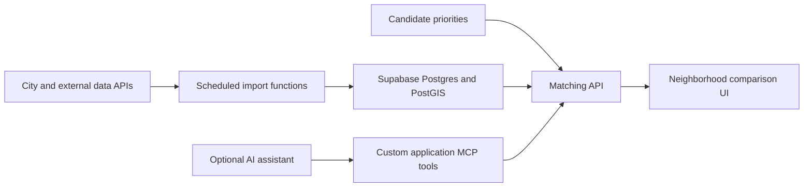

# Neighborhood matching: data and architecture

Researched and probed on 2026-09-19. Product goal: help tech recruits compare Houston neighborhoods according to their own priorities and household needs.

**Scope update:** [Oleggo's build plan](build-plan.md) now defines the proposed MVP: a recruiter uses Claude to generate a shareable relocation report. Its TypeScript/Workers/KV architecture and tool names supersede the exploratory recommendations below. See [Phase 0 data notes](data-notes.md) for checks against the actual scoring requirements. Supabase remains an alternative; parks, schools, weather, and live routing are possible later features. V1 commute is straight-line miles.

## What is connected

- Houston's CKAN catalog and DataStore endpoints respond without an API key. The discovery utility and metadata inventory are in this branch.
- Additional City of Houston ArcGIS services responded to public read queries for neighborhood boundaries, parks, school locations, and floodplain features.
- NWS and modern USGS APIs returned current responses without credentials during testing.
- The backend owner's Supabase developer connector is authenticated. A `hou-match` project has not been created; there is no running application database or scheduled import yet.
- METRO, TranStar, and a traffic-aware routing provider have not been connected.

## Exploratory sources

| Matching input | Source and access | Freshness and verification | Use in the product |
| --- | --- | --- | --- |
| Neighborhood boundaries | [City administrative boundaries, layer 3](https://mycity2.houstontx.gov/gisweb01/rest/services/HoustonMap/Administrative_Boundary/MapServer/3), ArcGIS JSON/GeoJSON | Public count query returned 88 features. Reference geography; no live-update promise verified. | Polygon map and joins across source datasets. This defines a city-focused first version; suburbs need additional geography. |
| Housing affordability | [Houston ACS median gross rent](https://data.houstontx.gov/dataset/acs-5-year-median-gross-rent-estimates-at-block-group-level) and [housing value ranges](https://data.houstontx.gov/dataset/acs-5-year-household-value-estimates-at-block-group-level), CKAN DataStore | The catalog includes 2024 ACS five-year resources. Rent sampling succeeded; the resource reports 3,524 records. These are period estimates, not live asking rents or available listings. | Show a clearly labeled affordability baseline. Keep source geography and period; do not average block-group medians and present the result as an exact neighborhood median. |
| Parks and amenities | [City Neighborhood service](https://mycity2.houstontx.gov/gisweb01/rest/services/HoustonMap/Neighborhood/MapServer), parks layer 14 | Public count query returned 380 park features. Library, museum, community-center, and hospital layers also exist; their records were not independently sampled. | Distance to parks and other selected amenities. Updates depend on the publisher. |
| Schools | City Neighborhood layer 0 plus [TEA school information](https://tea.texas.gov/families-and-students/school-district-locator/about-sdl-geographic-data) and [accountability downloads](https://rptsvr1.tea.texas.gov/perfreport/account/acct_download?year=2026) | City school count query returned 1,541 features. TEA download interfaces identified; complete school-year ingestion remains untested. School performance is reported by year. | Candidate-selected school preferences and nearby campus information. Confirm enrollment boundaries with the district; nearby schools do not establish attendance eligibility. |
| Flood exposure | [City Flood Hazard service](https://mycity2.houstontx.gov/gisweb01/rest/services/HoustonMap/Flood_Hazard/MapServer), including Harris/FEMA floodplain layers | Harris 100-year floodplain count query returned 3,957 features. Effective map dates still need validation before scoring. The direct FEMA endpoint probe failed from this environment. | Long-term floodplain overlap/context. A live gauge reading is not a parcel flood-risk assessment. |
| Drive commute | [Google Routes traffic-aware routing](https://developers.google.com/maps/documentation/routes/config_trade_offs) | Documented live/historical traffic support; no project key or billing configured and no successful route request yet. | Compute workplace commute for the candidate's chosen departure time. Use representative weekday travel for relocation decisions and label current ETAs separately. |
| Public transit | [Houston METRO APIs](https://api-portal.ridemetro.org/) | Near-real-time arrival predictions and service alerts; requires account/subscription key. Not yet authorized or tested. | Optional transit commute context. Static schedules and live predictions serve different purposes. |
| Current weather | [NWS API](https://www.weather.gov/documentation/services-web-api) | Public requests for downtown Houston point metadata and active alerts succeeded. Alert response was updated on the research date; zero active features is a valid response. User-Agent required. | Current alerts and forecast context. Respect cache headers; refresh does not imply a fixed source update interval. |
| Current water conditions | [USGS latest continuous API](https://api.waterdata.usgs.gov/ogcapi/v0/collections/latest-continuous?f=html) | Harris County sample returned same-day observations, about 35-50 minutes old at retrieval. Sensors are often collected at 15-minute intervals; transmission delays vary. Higher rate limits require an API key. | Optional current streamflow/gauge-height context, with observation time and provisional status displayed. |
| Reported crime | [HPD monthly NIBRS downloads](https://www.houstontx.gov/police/cs/Monthly_Crime_Data_by_Street_and_Police_Beat.htm) | Monthly files, with publication delay. Download workflow identified; not ingested. | Optional historical context. HPD cautions against raw comparisons across police beats; beat boundaries also differ from neighborhoods. Do not turn raw counts into an unsupported safety ranking. |

The current-working GIS prefix is `https://mycity2.houstontx.gov/gisweb01/rest/services/`. An older `pubgis02` parks URL appeared in search results but returned an ArcGIS service-not-started error. HTTP 200 alone is insufficient: check the JSON for an `error` field.

## Feeds to hold back from the first demo

[Houston 311 recent requests](https://mycity2.houstontx.gov/pubgis01/rest/services/311/Houston311_RecentServiceRequests/FeatureServer) advertises a 30-minute refresh. However, both newest creation and closure dates in the tested table were on 2026-05-28, months before testing. An alternate production NEW layer returned no maximum creation date. Keep 311 out of any live-data claim until the current source is identified and its record timestamps verified. Source timestamps and fetch timestamps must be separate fields.

[TranStar](https://traffic.houstontranstar.org/api/api_doc.aspx) documents JSON incident and lane-closure feeds updated once per minute. Live access requires contacting TranStar. This is a later integration unless credentials are already available; a sample feed is not live access.

## Alternative: how Supabase could fit

Proposed flow:

If selected, Supabase could provide the application's data store and backend services:

- Store neighborhood polygons, source observations, metric dates, provenance, and successful import times.
- Use [PostGIS](https://supabase.com/docs/guides/database/extensions/postgis) to relate points and polygons and compute proximity. Convert source coordinate systems before spatial joins.
- Store each candidate's chosen budget, workplace, commute tolerance, and factor weights. Add authentication and user-specific access policies when saving private preferences.
- Implement deterministic matching rules that apply hard requirements, then combine normalized metrics using the candidate's weights. Return the factor contributions, missing-data flags, and source dates with every result. Let an AI explain those results rather than invent numerical scores.
- Use [scheduled Edge Functions](https://supabase.com/docs/guides/functions/schedule-functions) to import sources at appropriate intervals. A 15-minute polling job does not make annual estimates real-time.
- Optionally use [Supabase Realtime](https://supabase.com/docs/guides/realtime/postgres-changes) to refresh the UI when imported rows change. Realtime distributes changes in our database; an importer still has to fetch changes from Houston and other providers.

Suggested first entities are `neighborhoods`, `source_metrics`, `candidate_preferences`, and `import_runs`. This is a design proposal; no schema or tables have been created. Keep migrations, grants, and RLS policies together when implementation begins.

## MCP and Supabase: two uses

**For the developers:** the [official Supabase MCP server](https://supabase.com/docs/guides/ai-tools/mcp) gives coding agents tools to inspect schemas, run queries, and manage migrations. The backend owner's connection is already authenticated. Each agent needs its own access; scope it to the intended project once created.

**For the product's AI assistant:** build a small application MCP server with tools such as `find_neighborhoods`, `compare_neighborhoods`, and `get_commute_estimate`. These would call the same matching backend used by the website and return structured results with sources and timestamps. Supabase documents [hosting custom MCP servers on Edge Functions](https://supabase.com/docs/guides/functions/examples/mcp-server-mcp-lite). This is feasible but has not been built here.

The public-facing assistant should receive those purpose-specific, authenticated tools. The official developer MCP has administrative capabilities and is not the application's end-user interface. A conventional matching website can use its backend API directly; custom MCP becomes useful when an AI assistant needs those same functions.

## Earlier scope proposal (superseded by the build plan)

Start with candidate-weighted comparison of the 88 city super neighborhoods using affordability, park access, school information, floodplain context, and commute estimates when a routing key is available. Add current NWS alerts and USGS observations as a separate conditions panel if time allows. Show coverage and dates, and label estimates clearly.

Use the candidate's explicitly selected factors to personalize results. Avoid inferring priorities from a resume or from demographic composition. Keep the initial geography, factor definitions, and missing-data behavior visible so the team can explain every recommendation during the demo.
